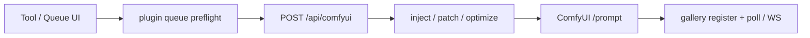

# Architecture

Contributor map of how Prompt Studio is wired. Product setup and feature lists live in the [documentation hub](README.md) and [main README](../README.md).

## Shape

Next.js App Router under `src/app/`, shared UI in `src/components/`, domain logic in `src/lib/`, hooks in `src/hooks/`.

| Layer                         | Responsibility                                                                                                   |
| ----------------------------- | ---------------------------------------------------------------------------------------------------------------- |
| **Client**                    | Tool UIs, Dexie settings/history/workflows/gallery, plugin install, Comfy job register + poll/WebSocket          |
| **Server (`src/app/api/**`)** | LLM calls, ComfyUI `/prompt` proxy + inject/preflight, auth/session/ACL, optional SQLite under `PROMPT_DATA_DIR` |
| **Edge gate**                 | `src/proxy.ts` — auth, rate limit, usage log before route handlers                                               |

Shell (`src/app/layout.tsx`) wraps pages with `AuthProvider`, `AppNav`, gallery background poller, and storage sync.

## Persistence

### Browser (primary)

IndexedDB via Dexie — database `comfy-prompt-studio-v1` (`src/lib/app-db.ts`):

- `galleryEntries` — Comfy jobs and outputs
- `kv` — settings, prompt history, workflow library, plugins, projects, etc.

Access: `src/lib/browser-storage.ts`, `src/lib/gallery-db-store.ts`, init `src/lib/app-db-init.ts`. Legacy `localStorage` keys migrate into Dexie on first hydrate. Theme/density stay mirrored in `localStorage` for the FOUC script and are also included in `studio-extras` sync.

Durable browser writes listed in `src/lib/durable-sync-keys.ts` schedule a debounced server push.

### Server (optional SQLite)

When `PROMPT_DATA_DIR` is set, Prompt Studio opens `{PROMPT_DATA_DIR}/studio.sqlite` (WAL) via `src/lib/sqlite/studio-db.ts`:

- Namespaces (`src/lib/storage-namespaces.ts`) in a `kv` table, scoped `global` or `user:{userId}`
- Gallery rows in `gallery_entries` (not one JSON blob); tombstones in `gallery_deleted_ids`
- Auth, sessions, API keys, reset tokens, audit, LLM usage, analytics, collab rooms as tables
- SMTP / queue-export overlays in `kv`

Leftover JSON files (`*.json` under the data dir and `auth/`) are imported once on first open and renamed to `*.json.imported`. Per-user export snapshots remain files under `users/{userId}/exports/`. ComfyUI view-cache images stay as files.

Without `PROMPT_DATA_DIR`, `/api/storage` is disabled. Auth and shared presets still persist to `studio.sqlite` under the default data root (`.prompt-studio-data`). SMTP overlay stays in memory until restart.

**Studio backup** (`src/lib/studio-backup.ts`) is a versioned JSON download (v5) of history, settings, gallery, and `collectStudioExtras()` (gallery ELO and other Dexie KV). It is not a dump of `PROMPT_DATA_DIR`.

**Auto-synced namespaces** (`SYNC_STORAGE_NAMESPACES`): `settings-cache`, `prompt-history`, `comfy-gallery`, `gallery-deleted-ids`, `studio-extras`.

`studio-extras` covers workflows, ComfyUI settings, recipes, projects, webhooks, avoided tokens, templates, campaigns, appearance prefs, onboarding, workspace mode, held-max jobs, notifications, and other durable browser state. Legacy namespaces (`scheduled-batch`, `webhook-settings`, `avoided-tokens`, `prompt-projects`) are folded into `studio-extras` on pull.

Sync helpers: `src/lib/storage-sync.ts`, `src/lib/auto-storage-sync.ts`, `src/lib/studio-extras.ts`, APIs under `src/app/api/storage/**`. Browser Dexie remains the working cache; the server database is the durable copy.

## ComfyUI queue path



| Step                                     | Module                                                                    |
| ---------------------------------------- | ------------------------------------------------------------------------- |
| Client POST + early WebSocket `clientId` | `src/lib/comfyui-queue-request.ts`                                        |
| Result-panel queue actions               | `src/hooks/usePromptResultActions.ts`                                     |
| API entry                                | `src/app/api/comfyui/route.ts`                                            |
| URL/workflow resolve + queue             | `src/lib/comfyui-client.ts`                                               |
| Tokens, inject, loaders, images          | `src/lib/comfyui-config.ts`                                               |
| Graph optimize / direct patch            | `src/lib/workflow-queue-optimizer.ts`, `src/lib/workflow-direct-patch.ts` |
| Workflow library (Dexie KV)              | `src/lib/comfyui-workflow-files.ts`                                       |
| Draft / Final / Max (+ per-tool)         | `src/lib/queue-quality-profile.ts`, `src/lib/tool-quality-profiles.ts`    |
| Plugin mutators                          | `src/lib/plugin-queue-hooks.ts`                                           |
| Gallery + progress                       | `src/lib/comfyui-gallery-client.ts`, `src/lib/comfyui-websocket.ts`       |
| Engine seam (queue / progress)           | `src/lib/engine` → `getEngineAdapter()`                                   |

Related routes: `src/app/api/comfyui/{status,history,view,upload,interrupt,live,probe,…}/`, `src/app/api/diffusers/{,status,view,upload}/`, `src/app/api/fal/{,status,view,upload}/`, `src/app/api/replicate/{,status,view,upload}/`, and `src/app/api/{openai,gemini,grok}/{,status,view,upload}/`.

Pool members: `parseComfyUiPool()` merges `COMFYUI_POOL` with Settings `comfyPoolUrls` after `normalizeComfyPoolUrlList` (allowlist fail-closed per URL). Probe (`POST /api/comfyui/probe`) does not fetch hosts missing from `COMFYUI_ALLOWED_HOSTS`.

## Engine adapter

Thin browser seam for **queue / status / view / upload / progress** so backends can plug in without rewriting gallery or prompt tools.

| Piece                    | Path                                                                                                |
| ------------------------ | --------------------------------------------------------------------------------------------------- |
| Interface                | `src/lib/engine/types.ts` (`EngineAdapter`)                                                         |
| Comfy implementation     | `src/lib/engine/comfy-adapter.ts`                                                                   |
| Diffusers implementation | `src/lib/engine/diffusers-adapter.ts`                                                               |
| Fal implementation       | `src/lib/engine/fal-adapter.ts`                                                                     |
| Replicate implementation | `src/lib/engine/replicate-adapter.ts`                                                               |
| Runway implementation    | `src/lib/engine/runway-adapter.ts` + `src/lib/runway-client.ts`                                      |
| ChatGPT / Gemini / Grok  | `src/lib/engine/cloud-adapter.ts` + `src/lib/llm-image-client.ts` + `src/lib/cloud-video-client.ts` |
| Cloud registry           | `src/lib/engine/capabilities.ts` (`CLOUD_ENGINE_OPTIONS`)                                           |
| Selection                | `getEngineAdapter()` / `getEngineAdapterById()` in `src/lib/engine/index.ts`                        |
| Settings                 | `inferenceEngine` + Diffusers URL + cloud key/model (Settings → Inference engine)                   |
| Python service           | `services/diffusers-engine/` (optional FastAPI txt2img)                                             |

Methods: `postPrompt`, `fetchJobStatus`, `buildViewPath`, `uploadInputImage`, `subscribeProgress`, `openProgressBeforeQueue`.

Backends today:

- **`comfyui`** (default) — primary generate path via `/api/comfyui/*` (Qwen Lightning bf16 + Dynamic VRAM, Final/Max enrich, ControlNet, FaceDetailer, edit, video, custom graphs).
- **`diffusers`** (optional) — **local stills only** (txt2img + limited native graph compile) via `/api/diffusers/*` → local FastAPI (`DIFFUSERS_API_URL`, default `http://127.0.0.1:8190`). Opt in from Settings or `PROMPT_ENGINE=diffusers`. Inpaint (SDXL/Flux/Qwen), ControlNet Canny/OpenPose/depth/lineart/softedge/normal/MLSD (SDXL + classic Flux + Qwen plain: ± stacked multi-ControlNet; SDXL/Flux also ±img2img/inpaint; SDXL ± IP-Adapter; Qwen InstantX CN-Inpainting on inpaint graphs), SDXL IP-Adapter + InstantID identity lock, and Final/Max enrich (Spandrel upscale + `ImageScaleBy`) compile natively; everything else — Play film, Flux2-Klein ControlNet/inpaint, PuLID, FaceDetailer, Dynamic VRAM — still routes to ComfyUI or a cloud engine. On 24GB, Qwen Lightning quality/speed remains Comfy’s strength; Diffusers Dynamic VRAM / bf16 parity stays a non-goal (parked, see services/diffusers-engine/README.md).
- **`fal`** (optional) — cloud stills + clips via `/api/fal/*` → [Fal queue](https://fal.ai). Prompt + optional Image 1; Video uses Kling / WAN / LTX / Grok Imagine / Veo presets. Local clips can upload to Fal CDN then call LTX extend-video when the upload succeeds; otherwise continue is last-frame I2V. Key: `FAL_KEY` or Settings.
- **`replicate`** (optional) — same cloud contract via `/api/replicate/*` → [Replicate predictions](https://replicate.com). Stills + Kling / WAN / LTX clips. No extend API (continue is last-frame I2V). Token: `REPLICATE_API_TOKEN` or Settings.
- **`openai`** (optional) — ChatGPT Images via `/api/openai/*` → `POST /v1/images/generations` (default `gpt-image-2`). Stills only — Sora is deprecated. Key: `OPENAI_API_KEY` or Settings.
- **`gemini`** (optional) — Gemini native image via `/api/gemini/*` → `generateContent` (default `gemini-3.1-flash-image`). Video tool uses documented Veo `generate_videos` / `predictLongRunning` (`veo-3.1-generate-preview`). Key: `GEMINI_API_KEY` or Settings.
- **`grok`** (optional) — xAI Imagine stills via `/api/grok/*` → `POST /v1/images/generations` (default `grok-imagine-image-2.0`). Video tool uses `POST /v1/videos/generations` (`grok-imagine-video-1.5`). Key: `XAI_API_KEY` or Settings.
- **`runway`** (optional) — Gen-4 stills + Gen-4.5 / Aleph clips via `/api/runway/*` → [Runway Dev API](https://docs.dev.runwayml.com/). Text/image → `POST /v1/text_to_image`; T2V/I2V → `text_to_video` / `image_to_video`; continue/extend → `POST /v1/video_to_video` (`aleph2`). Key: `RUNWAY_API_KEY` or Settings.

Add another provider by extending `CLOUD_ENGINE_OPTIONS` plus an adapter and `/api/<id>` proxy.

Diffusers progress is **poll-backed** (no live latent WebSocket). Gallery entries store `comfyUrl` as the engine host and optional `engineId` so poll/view use the correct adapter after the user switches engines.

**In scope of the seam:** engine I/O (queue a job, poll status, proxy pixels, upload inputs, live/poll progress).

**Out of scope (stay studio-owned):** prompt drafting, quality profiles, LoRA stacking, workflow injection/optimize, gallery IndexedDB, interrupt / free / object-info.

Consumers: gallery re-queue (`src/lib/comfyui-requeue.ts`), result-panel send/batch (`src/hooks/usePromptResultActions.ts`), gallery poll (`src/lib/comfyui-gallery-client.ts`).

## Auth and ACL

Enabled when `PROMPT_AUTH_ENABLED=true` or leftover `users.json` / imported users exist (`src/lib/auth/config.ts`, `src/lib/auth/store.ts`).

Roles (`src/lib/auth/types.ts`): `admin` | `user` | `viewer`.

- **admin** — all features
- **viewer** — `dashboard`, `gallery`, `studio` only
- **user** — all features minus personal + group `blockedFeatures`

Feature IDs and page/API maps: `src/lib/auth/features.ts` (e.g. `/` → `generate`, `/api/comfyui` → `comfyui-api`, LLM routes → `llm-api`).

Gate path: `src/proxy.ts` → `authorizeAppRequest` (`src/lib/auth/access.ts`). Nav filters by `allowedFeatures` from `/api/auth/session` (`src/hooks/useAuth.tsx`, `src/components/AppNav.tsx`).

Session cookie `prompt-studio-session`; also Bearer / `x-prompt-api-token` / per-user API keys.

Invites: `POST /api/auth/invite` (admin) creates or re-sends a user and emails a 1-hour reset token via `src/lib/email/notifications.ts`. Mailer: `src/lib/email/mailer.ts` (transporter rebuilt when SMTP overlay changes).

## Plugins

Client Dexie manifests (`src/lib/plugin-manifest.ts`) plus an optional **server registry** under `{PROMPT_DATA_DIR}/plugins` (`src/lib/server-plugin-registry.ts`, `GET`/`POST`/`DELETE /api/plugins/server`).

```ts
{
  id, label, version, enabled?,
  nav?: [{ href, label, description }],
  queueHooks?: { url, events, privileges? },  // e.g. "queue-preflight", "queue-post"
  tools?: [{ id, title, iframeUrl?, route? }]
}
```

- Nav merges into the sidebar catalog
- Browser queue hooks run via `runPluginQueuePreflight` before Comfy queue
- **Server** plugins with privileges run inside `queuePromptToComfyUi` (`queue-preflight` / `queue-post`) with allowlisted prompt / params / workflow JSON rewrite
- Custom tools render at `/plugins/[id]` (`src/app/plugins/[id]/page.tsx`)
- Iframe host protocol (queue / apply-prompt / LoRA stack / workflow tokens / gallery tag / engine): [plugin-iframe-host.md](plugin-iframe-host.md); example at `/plugin-examples/hello-iframe.html`
- Caps: 48 client runtime plugins, 32 server plugins, 24 manual queue hooks; bookmarks stay separate (32)

Bookmarks (non-manifest) are separate: `src/lib/tool-plugin-registry.ts`. Example hook: `src/app/api/plugin-hooks/denoise-rewrite/route.ts`. Optional install HMAC: `PROMPT_PLUGIN_HMAC_SECRET`.

## LLM and vision

| Concern                                  | Where                                                                  |
| ---------------------------------------- | ---------------------------------------------------------------------- |
| Chat / vision client                     | `src/lib/llm-client.ts`                                                |
| Env helpers                              | `src/lib/llm-env.ts`                                                   |
| Vision downscale/recompress before model | `src/lib/vision-image-prepare.ts`                                      |
| Generate / format / refine               | `/api/generate`, `/api/format`, `/api/refine` (+ tool-specific routes) |

LLM routes are gated as `llm-api` when auth is on. Prompt cleanup / thinking-artifact stripping lives in `src/lib/prompt-cleanup.ts`.

## Env categories

See `.env.example` for the full list. Groups that matter for architecture:

| Category    | Examples                                                                                               |
| ----------- | ------------------------------------------------------------------------------------------------------ |
| LLM         | `LLM_ENABLED`, `LLM_API_BASE_URL`, `LLM_MODEL`, `LLM_VISION_MODEL`                                     |
| ComfyUI     | `COMFYUI_API_URL`, `COMFYUI_POOL`, `COMFYUI_ALLOW_CLIENT_URL`, `COMFYUI_ALLOWED_HOSTS`, `COMFYUI_ROOT` |
| Auth        | `PROMPT_AUTH_ENABLED`, `PROMPT_ADMIN_*`, `PROMPT_SESSION_SECRET`, `PROMPT_API_TOKEN`, `PROMPT_API_URL` |
| Persistence | `PROMPT_DATA_DIR`, `PROMPT_AUTH_DIR`                                                                   |
| Email       | `PROMPT_SMTP_*`, `PROMPT_EMAIL_FROM` (overlay in SQLite `kv`)                                          |
| Ops         | `API_RATE_LIMIT_*`, scheduled batch / maintenance flags                                                |

## Where to look next

| Question                                     | Start here                                                                       |
| -------------------------------------------- | -------------------------------------------------------------------------------- |
| Why did queue change my graph?               | `comfyui-config.ts`, `workflow-queue-optimizer.ts`, Settings → workflow takeover |
| Where did this setting go?                   | Dexie `kv` via `browser-storage.ts` / `settings-cache`                           |
| Why is a nav item missing?                   | `auth/features.ts` + user/group `blockedFeatures`                                |
| Why did invite/reset mail use the wrong URL? | `PROMPT_API_URL` — default is `http://127.0.0.1:47832`                           |
| Why did probe fail with allowlist?           | `url-safety.ts` / `COMFYUI_ALLOWED_HOSTS`; copy snippet from cluster panel       |
| Why did a plugin alter queue?                | `plugin-queue-hooks.ts` + installed manifests                                    |
| Refine / vision blew up?                     | `vision-image-prepare.ts`, `llm-client.ts`, `/api/refine`                        |
| Where does queue / progress hit the engine?  | `src/lib/engine` (`getEngineAdapter`) — ComfyUI or Diffusers                     |
